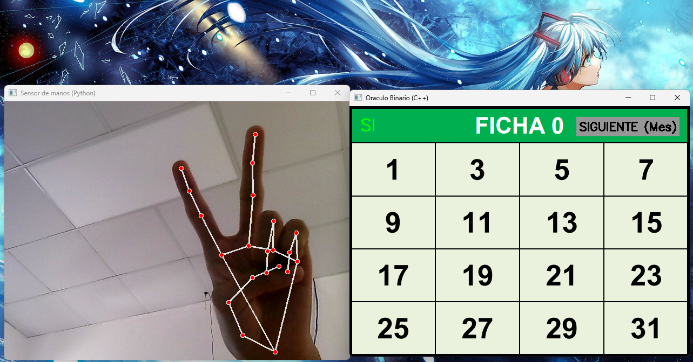
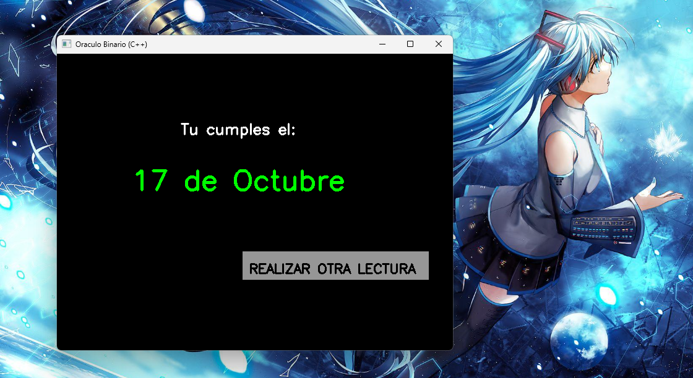

  <h1>Oráculo Binario</h1>
  
<em>Un sistema interactivo de visión artificial y cálculo matemático desarrollado en C++ y Python</em>

  
  

 

## Acerca del juego

Este programa es un oráculo interactivo capaz de adivinar tu fecha de cumpleaños (mes y día) leyendo los movimientos de tus manos. A través de la cámara web, el sistema te mostrará una serie de tablas numéricas y esperará tu respuesta mediante gestos en tiempo real: levanta solo el dedo índice para indicar "No", o los dedos índice y medio (símbolo de la paz) para indicar "Sí". Tras completar las rondas correspondientes al mes y al día, el programa procesará tus respuestas y revelará tu fecha exacta de nacimiento.

## Características principales del código

* **Arquitectura Multilenguaje:** Integración fluida entre un script de Python (visión artificial) y un cliente principal en C++ (interfaz y lógica de juego), manteniendo un enfoque robusto en el desarrollo de software interconectado con múltiples lenguajes.
* **Comunicación por Sockets UDP:** Implementación de una red local mediante `winsock2.h` (C++) y la librería nativa `socket` (Python) a través del puerto 5052, permitiendo el envío ultrarrápido de las coordenadas de la mano como cadenas de texto segmentadas.
* **Procesamiento Concurrente (Multithreading):** Uso de la librería `<thread>` en C++ para ejecutar el receptor de red (`comunicador()`) en segundo plano de manera asíncrona. Esto evita que el bucle gráfico de OpenCV se congele mientras espera la llegada de los paquetes de datos.
* **Visión Artificial y Rastreo de Gestos:** Utilización de MediaPipe en Python para identificar los puntos de articulación de la mano (landmarks). El algoritmo compara las posiciones en el eje Y de las puntas de los dedos con sus respectivas articulaciones medias para determinar de forma precisa la intención del usuario.
* **Decodificación por Lógica Binaria:** Algoritmo matemático que traduce el vector de respuestas (`respuestasFinales`) en la fecha de cumpleaños final, sumando potencias de 2 (`pow(2, i)`) en base a los gestos afirmativos registrados durante las iteraciones de las tablas.

## Imagen del juego

  
  
   
  <em>Izquierda: Visualizando la tabla y Python leyendo la mano en tiempo real.   Derecha: El sistema calculando y adivinando la fecha exacta.</em>

